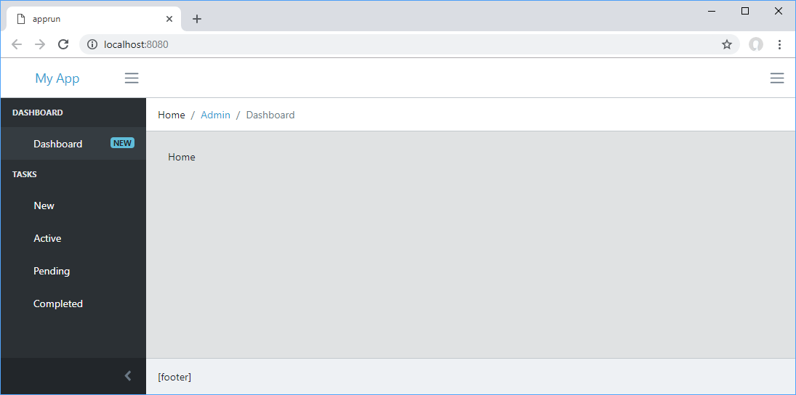
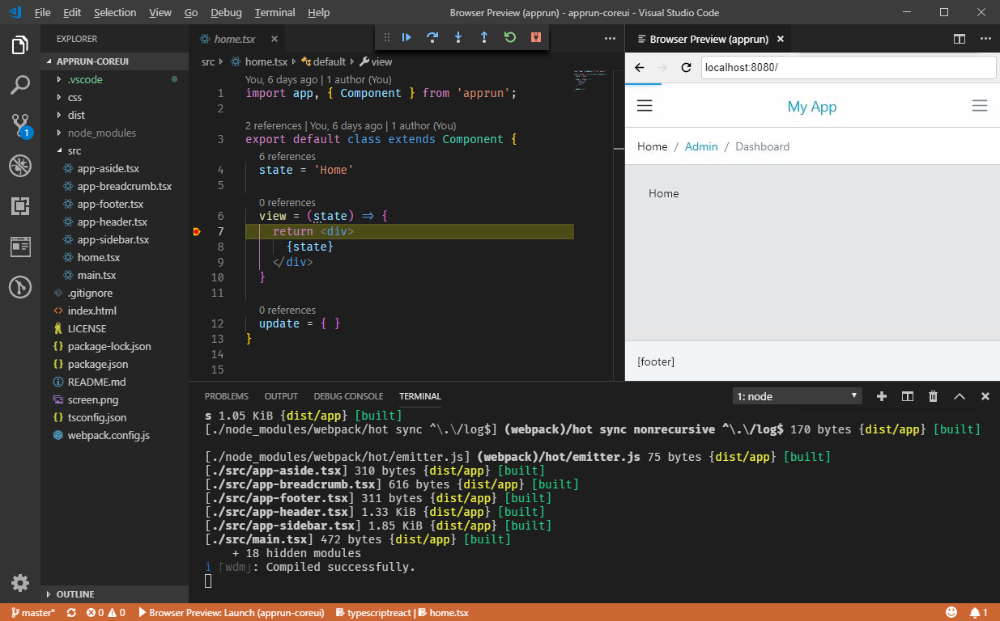

## AppRun Application Using CoreUI

This is an application built with [AppRun](https://github.com/yysun/apprun) using the
[CoreUI Free Bootstrap Admin Template](https://github.com/coreui/coreui-free-bootstrap-admin-template).

* Use _npm start_ to start the dev server
* Use _npm test_ to run unit tests
* Use _npm run build_ to build for production
* Debug using the [Browser Preview for VS Code](https://github.com/auchenberg/vscode-browser-preview)

